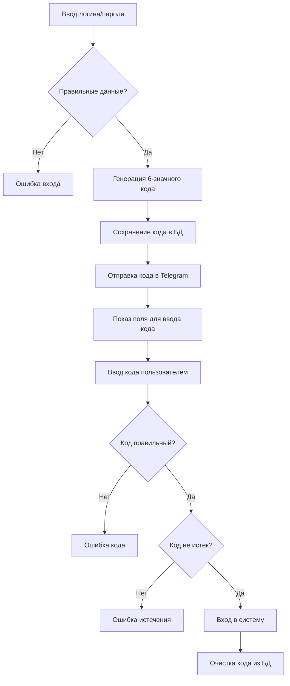

# 🔐 Руководство по двухфакторной аутентификации (2FA)

## 📋 Описание системы

Система двухфакторной аутентификации (2FA) обеспечивает дополнительную безопасность для входа в админ панель. После ввода правильного логина и пароля, система отправляет 6-значный код в Telegram бот, который необходимо ввести для завершения входа.

## 🔑 Данные для входа

### Админ аккаунт:
- **Логин:** `Rodeos`
- **Пароль:** `Rodeos24102007`
- **Telegram Chat ID:** `1172834372`

## 📱 Процесс входа

### Шаг 1: Ввод логина и пароля
1. Откройте страницу входа на сайте
2. Введите логин: `Rodeos`
3. Введите пароль: `Rodeos24102007`
4. Нажмите кнопку "Войти"

### Шаг 2: Получение кода
1. После правильного ввода логина/пароля появится дополнительное поле
2. В Telegram бот придет сообщение с 6-значным кодом
3. Код действителен **5 минут**

### Шаг 3: Ввод кода
1. Введите 6-значный код в поле на сайте
2. Нажмите кнопку "Подтвердить код"
3. При правильном коде вы войдете в админ панель

## 🔧 Технические детали

### Генерация кода
```python
def generate_auth_code():
    """Генерирует 6-значный код для двухфакторной аутентификации"""
    return ''.join(random.choices(string.digits, k=6))
```

### Отправка в Telegram
```python
def send_auth_code_to_telegram(user, auth_code):
    """Отправляет код аутентификации в Telegram"""
    message = f"🔐 <b>Код для входа в админ панель</b>\n\n"
    message += f"👤 Пользователь: <code>{user.username}</code>\n"
    message += f"🔢 Код: <code>{auth_code}</code>\n\n"
    message += f"⏰ Код действителен 5 минут\n"
    message += f"📋 Нажмите на код для копирования"
```

### Структура базы данных
```sql
-- Поля для 2FA в таблице user
auth_code VARCHAR(6)           -- 6-значный код
auth_code_expires TIMESTAMP    -- время истечения кода
```

## 🛡️ Безопасность

### Защита от атак:
- ✅ Код действителен только 5 минут
- ✅ Код используется только один раз
- ✅ Код автоматически очищается после входа
- ✅ Код очищается при истечении времени
- ✅ Код отправляется только в настроенный Telegram

### Обработка ошибок:
- ❌ Неверный код → "Неверный код аутентификации"
- ⏰ Истекший код → "Код аутентификации истек"
- 📱 Ошибка отправки → "Ошибка отправки кода в Telegram"

## 🧪 Тестирование

### Запуск теста:
```bash
python test_2fa_system.py
```

### Что проверяет тест:
1. ✅ Первая стадия входа (логин/пароль)
2. ✅ Появление поля для ввода кода
3. ✅ Отправка кода в Telegram
4. ✅ Интерфейс ввода кода
5. ✅ Обработка неверного кода
6. ✅ Истечение времени кода

## 📱 Интерфейс

### Первая стадия (логин/пароль):
```html
<input type="text" placeholder="Имя пользователя" name="username">
<input type="password" placeholder="Пароль" name="password">
<button type="submit">Войти</button>
```

### Вторая стадия (код):
```html
<input type="password" value="***" readonly>  <!-- Заблокированный пароль -->
<div>📱 Код отправлен в Telegram</div>
<input type="text" placeholder="Введите 6-значный код" name="auth_code">
<button type="submit">Подтвердить код</button>
```

## 🔄 Процесс работы



## 🚀 Развертывание

### Переменные окружения:
```bash
TELEGRAM_BOT_TOKEN=8458514538:AAFIAT7BrKelIHie9-JscBnOlAFd_V2qyMY
DATABASE_URL=postgresql://...
SECRET_KEY=your-secret-key
```

### Инициализация админа:
```python
admin = User(
    username='Rodeos',
    email='rodeos@nexus.dark',
    password_hash=generate_password_hash('Rodeos24102007'),
    balance=10000.0,
    is_admin=True,
    is_banned=False,
    telegram_chat_id='1172834372'
)
```

## 📞 Поддержка

При возникновении проблем:
1. Проверьте, что Telegram бот работает
2. Убедитесь, что Chat ID правильный
3. Проверьте логи сервера
4. Запустите тест: `python test_2fa_system.py`

## 🎯 Заключение

Система 2FA обеспечивает надежную защиту админ панели, требуя подтверждения через Telegram для каждого входа. Это значительно повышает безопасность системы и защищает от несанкционированного доступа.

**🔐 Двухфакторная аутентификация активна и готова к использованию!**